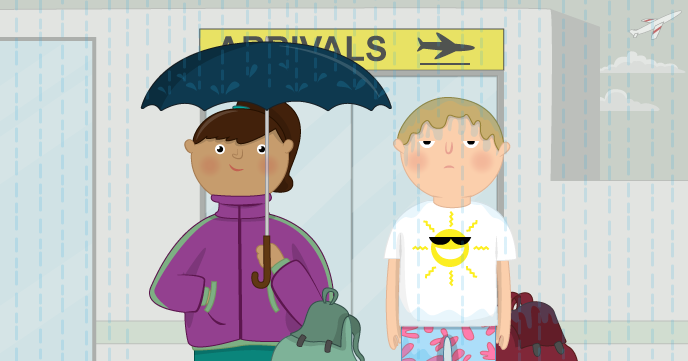

# Scary Spot the Difference

In this resource you can play a prank on your friends and family, by tricking them into thinking they're playing a Spot the Difference game, when in reality they're in for a big fright!

## The worksheets

* [Make this project with Python](worksheet.md)
* [Make this project with Scratch](worksheet2.md)

## Licence

Unless otherwise specified, everything in this repository is covered by the following licence:

***Scary Spot the Difference*** by the [Raspberry Pi Foundation](http://www.raspberrypi.org) is licenced under a [Creative Commons Attribution 4.0 International License](http://creativecommons.org/licenses/by-sa/4.0/).

Based on a work at https://github.com/raspberrypilearning/scary-spot-the-difference
