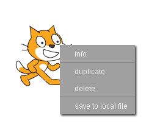

## Setting up your Scratch project

- [Open up a new project](http://jumpto.cc/scratch-new) in Scratch.

2. Delete the cat sprite by right-clicking on it, and then clicking Delete.

	

3. Now click on the Backdrops tab, and then click on the folder icon to upload a backdrop from file.

	

4. Select your scary picture and open it.

5. If your scary picture doesn't fill up the whole stage, use the select tool to draw a box around it and then use the handles on the box to make it larger.

	

6. Repeat these steps to add your Spot the Difference picture as a backdrop as well.

