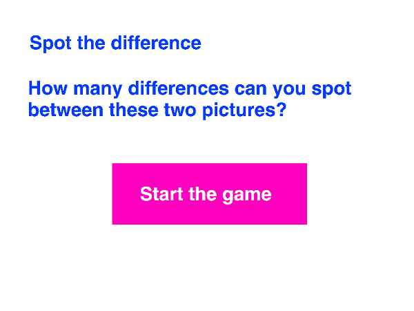

## Setting the scene

- You want your player to be fooled into thinking this is a real Spot the Difference game, so let's give them some instructions. Click on the blank backdrop (backdrop1) to select it, and click on the text tool.

	

2. With the text tool selected, click on the blank backdrop and write your fake game instructions. You can choose what to say, and don't forget to also draw a button for the player to click to start the game.

	

3. Name this backdrop "Instructions" so that you can find it easily when you write your program.

	

