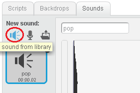

## Adding sound

To make your victim jump right off their chair, let's make a spooky sound play when the scary picture comes up. If you have a microphone you could record your own terrifying sound. If not, there are lots of good sounds already available from within Scratch.

- Click on the Sounds tab and then click on the speaker icon to use a sound from Scratch.

	

2. Choose your sound. You can find people screaming and evil laughs in the "Human" section, or perhaps you might want a howling wolf or a yowling cat from the "Animal" section? Click on the sound of your choice and then click OK.

3. Now go back to the Scripts tab and add a `play sound` block to play your sound immediately after the scary picture appears.

	

And you're done! Make sure to click the green flag to display the instructions (you don't want to spoil the surprise) and then invite an unsuspecting friend to play "Spot the Difference".

