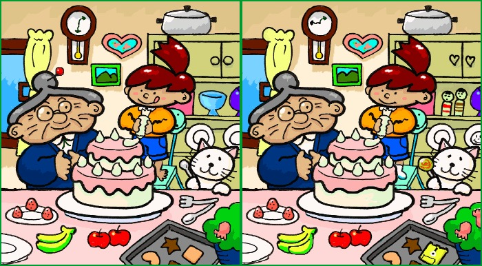

# Scary Spot the Difference

In this resource you will make a spot the difference game, with a *difference!*
While the player is busily trying to figure out the difference between two images, focused intently on the screen, they'll have no idea they're about to receive the fright of their lives.

## Gathering the assets.
1. You're going to need two images and a sound file for this activity. Firstly you'll need a *spot the difference image*. This one is free to use, but you can make or find your own if you prefer.

CC BY-SA 3.0, https://commons.wikimedia.org/w/index.php?curid=1864947
1. Then you'll need the image you're going to swap out to give them a fright. This hippo one should do the trick, but you can find your own online if you like.

CC BY-SA 2.0 [Catrin Austin](https://www.flickr.com/photos/catrinaustin/5915891844)
1. Lastly you'll need a scary sound to really give them a fright. You can download [this](http://soundbible.com/1627-Female-Scream-Horror.html) one, which should do the trick. Make sure you download the `wav` version of the file.
1. Save all the files in a single directory, where your python script will be.

## Setting up the pygame window
1. Open IDLE by clicking on `Menu`>``Programming`>`Python 3 (IDLE)`. Then click `File` and `New File`.
1. The new window that opens up will be where you can write the code. To begin with you'll need to import the pygame library and some of it's modules.

    ``` python
    import pygame
    from pygame.locals import*
    ```
1. Next you need to initialise pygame and then use a few variable to store some important constants. We want to set a screen fill colour, and the width and height of the images we're going to use.

    ``` python
    pygame.init()
    white = (255, 255, 255)
    w = 1280
    h = 675
    ```
    
1. Lastly for this section, you can instruct pygame to create a full-screen window that is filled with the colour white.

    ``` python
    screen = pygame.display.set_mode((w, h), FULLSCREEN)
    screen.fill((white))
    ```

1. Save your file and call it `run_me.py` (so we don't give anything away), and then run it by pressing `F5`.

1. You should see a blank rectangular window open. This is the pygame window. You can quit this by clicking on the cross in the upper corner of the window.

## Displaying and image
1. To display an image in pygame you first need to load the image up. You can start with the spot the difference image. Place this line below the `pygame.init()` line.

``` python
difference = pygame.image.load('Spot_the_difference.jpg')
```

1. Then in graphics terminology you need to *blit* the image onto the window, and then update the display, to show it.

    ``` python
    screen.blit(difference, (0, 0))
    pygame.display.update()
    ```
    This line blits the image to the coordinates x = 0 and y = 0. That is, the top left corner of the image is being place in the top left corner of the window.

1. Save and run the file again to see the image displayed.

## Switching images.
1. To switch the image to the scary one, you need to add a pause and then re-blit another image. To pause the program for awhile, you'll need the `time` module. Add this below your other `imports`.

    ``` python
    from time import sleep
    ```

1. Then add this line to load the scary image.

    ``` python
    hippo = pygame.image.load('hippo.jpg')
    ```

1. Now the program can be paused for 15 seconds or so, before you blit the new image. Add this to the end of the script.

    ``` python
    sleep(15)
    screen.blit(hippo, (0,0))
    pygame.display.update()
    ```

1. Save and run the program again, to see the new image being placed.

## Adding some sound

1. In Python, just like you did with the images, the sound needs to be loaded up first.

    ``` python
    scream = pygame.mixer.Sound("Female_Scream_Horror-NeoPhyTe-138499973.mp3")
    ```

1. Then, you want to start playing the sound, just before the second image is shown, as soon as the sleep has finished.

    ``` python
    scream.play()
    ```

1. Add a small pause to play the sound for a few seconds.

    ``` python
    sleep(3)
    ```

1. Then stop the scream and quit pygame.

    ``` python
    scream.stop()
    pygame.quit()
    ```

## Pranking your friends
1. Now all you need to do is have a friend come and try out your *Spot the difference* game. Tell them they have a minute to find as many differences as they can, and then watch them jump out of their skins when the scary image appears.

## What next?
1. Why not have a go at some more fun pranks with a physical element such as the [Grandpa Scarer]() or the [WhoopPi Cushion]()
