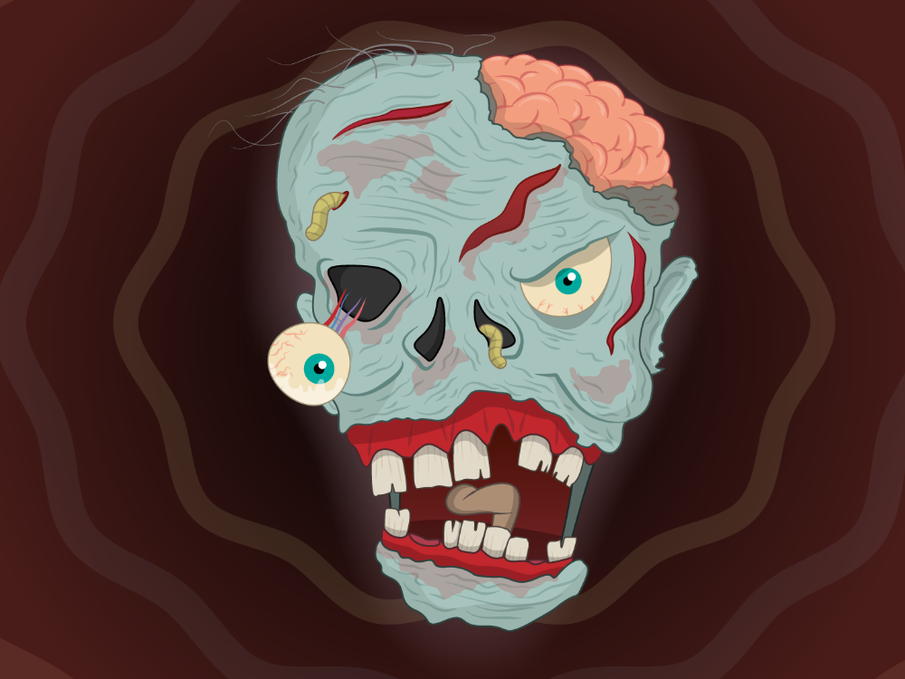
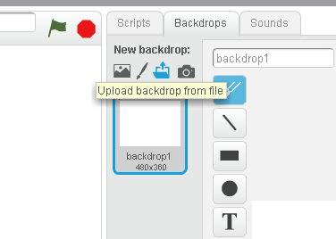
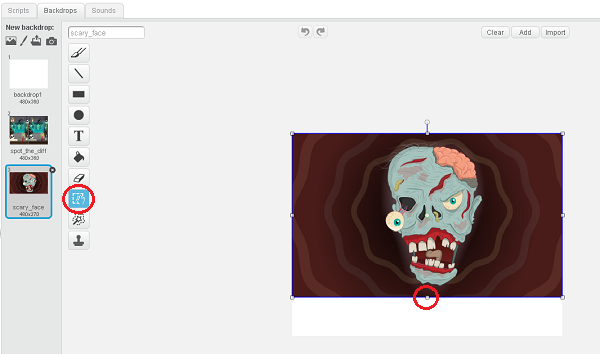
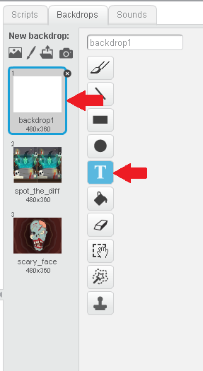
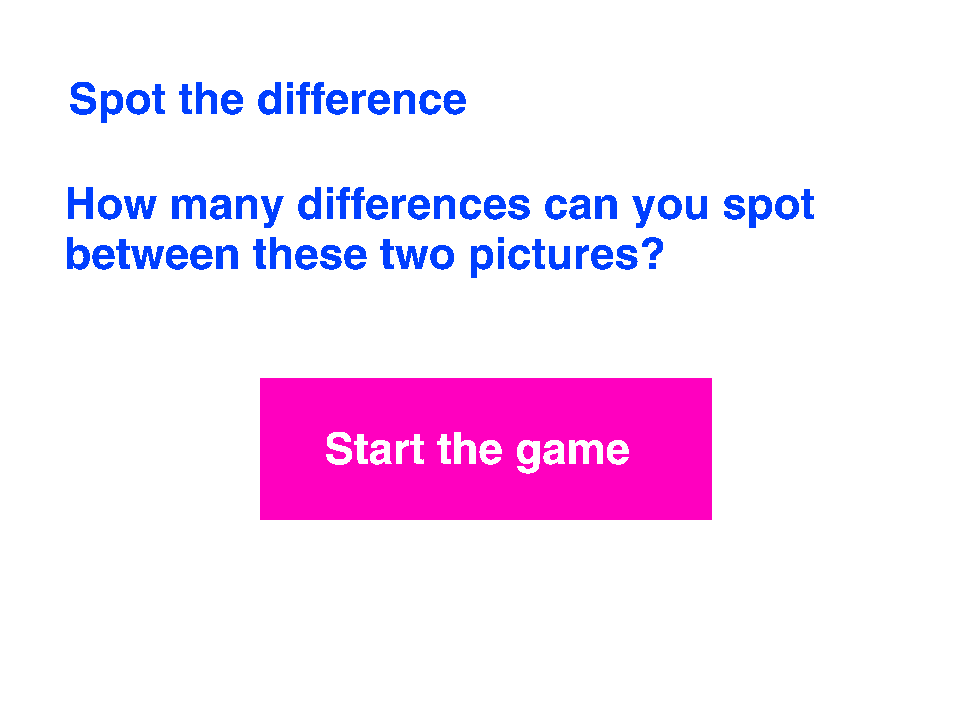
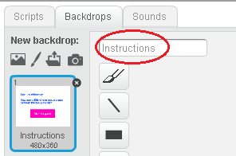
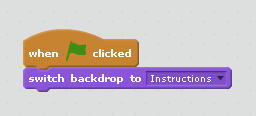
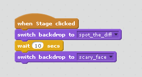
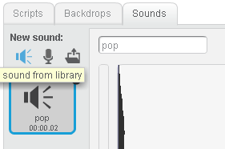
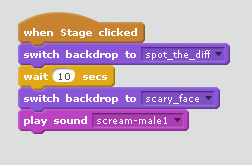

# Scary Spot the Difference - Scratch

In this resource you will make a Spot the Difference game with a difference! While the player is focused intently on the screen trying to figure out the difference between two very similar pictures, they'll have no idea they're about to receive the fright of their life.

If you would like to make this project using Python instead of Scratch, head on over to the [Python worksheet](worksheet.md).

## Gathering the assets

1. You're going to need two images and a sound file for this activity. Firstly, you'll need a Spot the Difference image. This one is free to use, but you can make or find your own if you prefer.

	If you would like to use this image, right-click on it and save it onto your computer.

	

2. Next, you'll need the image you're going to swap with the game image to give the player a fright. This zombie face is cool, but you can make or find your own if you like. Just remember the age of the people you're trying to scare and choose something appropriate.

	

3. Lastly, you'll need a scary sound to really give them a shock. You could download [this one](http://soundbible.com/1627-Female-Scream-Horror.html). Alternatively, you could use a sound from the Scratch library, or perhaps if you have a microphone you could record your own scary sound. Muhahahaha!

## Setting up your Scratch project

1. [Open up a new project](http://jumpto.cc/scratch-new) in Scratch.

2. Delete the cat sprite by right-clicking on it, and then clicking Delete.

	

3. Now click on the Backdrops tab, and then click on the folder icon to upload a backdrop from file.

	

4. Select your scary picture and open it.

5. If your scary picture doesn't fill up the whole stage, use the select tool to draw a box around it and then use the handles on the box to make it larger.

	

6. Repeat these steps to add your Spot the Difference picture as a backdrop as well.

## Setting the scene

1. You want your player to be fooled into thinking this is a real Spot the Difference game, so let's give them some instructions. Click on the blank backdrop (backdrop1) to select it, and click on the text tool.

	

2. With the text tool selected, click on the blank backdrop and write your fake game instructions. You can choose what to say, and don't forget to also draw a button for the player to click to start the game.

	

3. Name this backdrop "Instructions" so that you can find it easily when you write your program.

	

## Making the scary picture appear

Now it's time to add the code to make your prank work!

1. When the program starts, you want the page with the fake instructions to display. Click on the Scripts tab to add your code. The `switch backdrop` block from Looks can be used to control which backdrop is showing.

	

2. When the player clicks on the screen to start the game, the Spot the Difference picture should appear. Give them some time to look for the differences, then switch to the scary picture backdrop to give them a fright!

	Can you work out how to finish off the code below to make this work?

	

3. Test your game by clicking on the green flag to see if it works.

## Adding sound

To make your victim jump right off their chair, let's make a spooky sound play when the scary picture comes up. If you have a microphone you could record your own terrifying sound. If not, there are lots of good sounds already available from within Scratch.

1. Click on the Sounds tab and then click on the speaker icon to use a sound from Scratch.

	

2. Choose your sound. You can find people screaming and evil laughs in the "Human" section, or perhaps you might want a howling wolf or a yowling cat from the "Animal" section? Click on the sound of your choice and then click OK.

3. Now go back to the Scripts tab and add a `play sound` block to play your sound immediately after the scary picture appears.

	

And you're done! Make sure to click the green flag to display the instructions (you don't want to spoil the surprise) and then invite an unsuspecting friend to play "Spot the Difference".

## What next?

* To make the scare even more unpredictable, can you set the length of time between the game starting and the scary picture appearing to be a random number of seconds?
* Can you keep a fake score of differences spotted before the scary picture is displayed?
* Perhaps you could add a countdown timer so your friend will concentrate **really hard** trying to spot the differences before the time runs out?
